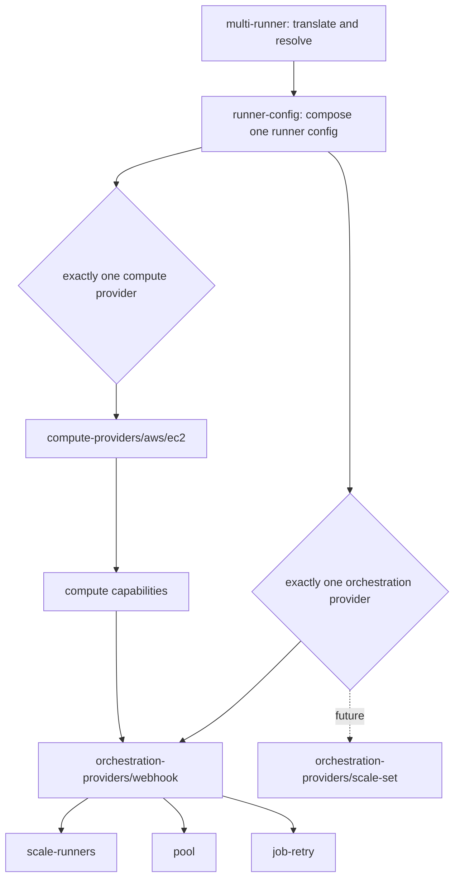

# ADR-002: Runner Orchestration Provider Boundary

## Status

Proposed

## Date

2026-09-03

## Context

The multi-runner module currently receives workflow-job demand through a shared
GitHub webhook. A build queue invokes scale-up, schedules invoke scale-down
and the runner pool, and an optional retry queue checks queued jobs. These
components evolved together, while their settings were spread across shared
module inputs and each runner configuration.

That layout assumes every runner configuration uses the same demand-control
model. It also makes the runner configuration responsible for webhook-specific
resources. Adding another model would require provider conditionals throughout
the module or a second copy of the common runner and compute-provider wiring.

GitHub Actions Runner Scale Sets require a different control model. A future
implementation is expected to use the runner scale-set and agent APIs:

- `_apis/runtime/runnerscalesets`
- `_apis/distributedtask/pools/0/agents`

Unlike event- and schedule-driven Lambda components, a scale-set controller
maintains reconciliation state and long-lived coordination with GitHub. It may
therefore need a containerized service, with ECS as a candidate deployment
target, rather than another independent Lambda handler.

The Terraform contract must allow that future addition without moving webhook
fields a second time. This ADR defines the boundary. It does not implement the
scale-set API client, controller, container image, or ECS resources.

## Terminology

- **Runner configuration**: One entry in `multi_runner_config`,
  including common runner behavior, one orchestration provider, and one compute
  provider.
- **Orchestration provider**: The implementation that receives or reconciles
  runner demand and owns the controls that turn demand into capacity actions.
- **Compute provider**: The implementation that creates and manages runner
  capacity, such as AWS EC2. It supplies capabilities to orchestration.
- **Webhook orchestration**: The existing webhook, queue, scale-up, scale-down,
  pool, and job-retry implementation.
- **Scale-set orchestration**: A future stateful controller built on GitHub's
  runner scale-set APIs.

## Decision

We will use typed orchestration-provider and compute-provider boundaries in the
experimental multi-runner interface. Every runner configuration selects
exactly one provider of each type.

### The experimental contract uses split global variables

The experimental interface is intentionally represented by separate Terraform
variables rather than one monolithic `experimental` object:

- `global_config` contains common global defaults such as tags,
  roles, and runner identity.
- `global_config_github` contains shared GitHub settings.
- `global_config_lambda` contains provider-neutral Lambda
  substrate and the shared artifact bucket.
- `global_config_orchestration_provider` contains global webhook
  defaults and shared webhook settings.
- `global_config_ssm` contains global SSM settings.
- `global_config_observability` contains logs, tracing, and
  metrics defaults.
- `global_config_compute_provider` contains global compute
  provider settings.
- `multi_runner_config` contains per-runner configuration
  overrides and provider selections.

For example:

```hcl
global_config = {
  tags = {
    Environment = "ci"
  }
}

global_config_observability = {
  metrics = {
    enabled = true
    metric = {
      github_app_rate_limit = { enabled = true }
      job_retry             = { enabled = true }
    }
  }
}

global_config_orchestration_provider = {
  webhook = {
    eventbridge = {
      enabled = true
    }
  }
}

multi_runner_config = {
  linux_arm64 = {
    orchestration_provider = {
      webhook = {
        runner = {
          boot_time_in_minutes = 5
          ephemeral            = true
          jit_config_enabled   = null
          maximum_count        = 4
        }

        github = {
          organization_runners = true
        }

        matcherConfig = {
          labelMatchers = [["linux", "arm64"]]
        }
      }
    }

    compute_provider = {
      aws = {
        ec2 = {
          instance_types = ["m7g.large"]
          on_demand_failover_for_errors = ["InsufficientInstanceCapacity"]
          instance_termination_watcher = {
            features = {
              runner_deregistration = { enabled = true }
              spot_termination_handler = { enabled = true }
              spot_termination_notification_watcher = { enabled = true }
            }
          }
        }
      }
    }
  }
}
```

The populated provider wrapper selects the provider; selection is not based on
a string discriminator. The wrapper's nullness and every value that controls
resource shape must be known during planning. Other values inside the selected
provider may remain unknown until apply.

### Provider selection is per runner configuration

Every entry in `multi_runner_config` must contain exactly one
non-null typed `orchestration_provider` block and exactly one non-null typed
`compute_provider` block. In this phase the supported blocks are:

- `orchestration_provider.webhook`
- `compute_provider.aws.ec2`

Validation counts non-null provider blocks rather than naming one special case.
A future provider can therefore be added as a sibling without changing the
selection rule. Different runner configurations may select different
providers once more than one exists, but one runner configuration cannot combine
providers.

### Global provider blocks provide defaults; they do not select providers

`global_config_orchestration_provider.webhook` is the global
defaults and shared-component namespace for webhook orchestration. Its
presence does not select webhook orchestration for every runner configuration.
Selection remains under
`multi_runner_config.<runner>.orchestration_provider`.

The global webhook namespace owns queue selection, EventBridge routing,
matcher-parameter tier, repository filtering, build-queue defaults, redrive
behavior, encryption, shared webhook Lambda settings, the runner-control
artifact, and default scale-up, scale-down, and pool settings.

Job-retry remains a per-runner webhook setting in this phase. Its typed block
supplies its own defaults rather than inheriting a global job-retry block.

For a selected webhook provider, resolution follows:

```text
runner configuration override > experimental global webhook default
```

Tag maps merge from broad to narrow. A runner-specific override affects only
that runner configuration; it does not configure a shared singleton.

### Canonical names describe ownership and enablement

Nested feature groups use an `enabled` field:

- `observability.metrics.enabled`
- `observability.metrics.metric.github_app_rate_limit.enabled`
- `observability.metrics.metric.job_retry.enabled`
- `observability.metrics.metric.spot_termination_warning.enabled`
- `instance_termination_watcher.features.runner_deregistration.enabled`
- `instance_termination_watcher.features.spot_termination_handler.enabled`
- `instance_termination_watcher.features.spot_termination_notification_watcher.enabled`

Standalone settings remain descriptive names ending in `_enabled`, for
example `managed_security_group_enabled`, `jit_config_enabled`,
`job_queued_check_enabled`, `detailed_monitoring_enabled`, and `ssm_enabled`.
The EC2 failover list is named `on_demand_failover_for_errors`.

Runner-binary configuration is owned by the compute provider's
`runner_binaries` block. It does not publish a global `targets` map. Binary
targets are derived from the resolved runner configurations that enable binary
synchronization, so the binary module does not depend on the effective
configuration it helps produce.

### Module ownership follows the provider boundary

| Layer | Responsibility |
| --- | --- |
| `modules/multi-runner` | Translates stable inputs, resolves global and per-runner values, owns shared ingress and queues, and routes typed provider objects. |
| `modules/runner-config` | Composes provider-neutral runner resources, selects exactly one orchestration provider and one compute provider, and connects provider capabilities. |
| `modules/orchestration-providers/webhook` | Owns webhook orchestration composition, defaults, tag layering, and scale, pool, and retry leaf modules. |
| `modules/orchestration-providers/webhook/scale-runners` | Owns scale-up and scale-down Lambdas, schedules, queue integration, IAM, and outputs. |
| `modules/orchestration-providers/webhook/pool` | Owns optional scheduled pool resources and IAM. |
| `modules/orchestration-providers/webhook/job-retry` | Owns optional queued-job retry resources and IAM. |
| `modules/runner-config/ssm-housekeeper` | Owns provider-neutral cleanup of runner token and configuration parameters. |
| `modules/compute-providers/<namespace>/<provider>` | Owns provider-specific capacity resources and returns policy, environment, managed-policy, and resource capabilities. |

Provider leaf modules live below `modules/orchestration-providers/<provider>`,
not below `modules/runner-config`. This keeps the common composition module
small and prevents provider-owned resources from becoming part of the common
contract.



### Compute providers expose capabilities, not orchestration resources

The selected compute provider remains independent from the selected
orchestration provider. It owns capacity resources and supplies the policy,
environment-variable, managed-policy, trust-policy, and resource capabilities
needed by the selected orchestration implementation.

`runner-config` adapts those outputs into the capabilities consumed by webhook
orchestration. The webhook provider owns its Lambda roles and attaches the
capability fragments it needs. The compute provider does not create webhook
resources.

This direction keeps the dependency graph one-way:

```text
runner-config -> compute provider -> capability contract -> orchestration provider
```

A future scale-set controller may require a different subset or extension of
the capability contract. That extension belongs at the provider boundary; it
must not add scale-set conditionals to webhook leaves.

### Compatibility and state are explicit

Stable inputs are translated into the same internal canonical representation so
defaults and shared singleton values have one resolution path. The unified
`multi_runner_config` input accepts either the stable v1 entry shape or the v2
provider-boundary entry shape. Stable entries continue to use the existing
`modules/runners` implementation when no v2 entries are present. When v2
entries are present, `experimental_features = ["multi-runner-v2"]` is required;
the v2 path combines native v2 entries with translated v1 entries from the
same map.

The experimental AWS EC2 provider intentionally remains separate from the
stable `modules/runners` implementation. It owns its own Terraform resource
definitions and copies of the runner bootstrap templates so the v2 provider
boundary can evolve without changing the stable module's public contract,
resource graph, state addresses, or deployed behavior. The template bodies are
equivalent at introduction; eight of the ten files are byte-identical, while
`cloudwatch_config.json` and `user-data.ps1` differ only by a final newline.

This isolation temporarily duplicates Terraform and template code. Equivalent
fixes must be evaluated for both implementations, and review should explicitly
check for unintended drift. Consolidation is deferred until stable v1 is
deprecated and a migration can be designed and verified independently.

The canonical v2 output groups orchestration resources under
`orchestration_provider.webhook` and compute resources under the selected
namespace and provider, currently `provider.aws.ec2`. Compatibility aliases
may remain during the experimental transition, but new consumers must use the
canonical paths.

This ADR does not define automatic stable-v1-to-v2 state migration. Existing
deployments remain on the stable path until that migration is separately
designed and documented.

### Existing shared modules stay unchanged

The orchestration-provider boundary does not change the public contracts or
resource addresses of `modules/webhook` or `modules/ssm`.

The shared webhook remains at its existing module address. The shared SSM module
continues to create or reference the webhook secret even when no runner
configuration selects webhook orchestration. That singleton contract is
independent of per-runner exact-one provider selection.

Any later proposal to make those shared modules conditional is a separate
compatibility and state decision.

### Scale-set implementation is deferred

No `scale_set` field is added in this phase. The typed object and module layout
reserve the extension point without publishing an incomplete contract.

A follow-up design must decide the public SDK surface, authentication and API
versioning, reconciliation and persistence, controller recovery and
concurrency, container release, ECS networking and scaling, compute-provider
capabilities, and Terraform migration/coexistence behavior.

The intended end state permits webhook and scale-set orchestration in the same
multi-runner module instance when different runner configurations select them.
It does not permit both controllers to own the same runner configuration.

## Consequences

### Positive

- A future orchestration provider becomes a sibling module instead of a
  cross-cutting conditional.
- Common runner settings and compute-provider configuration remain reusable.
- Provider-owned queue, Lambda, artifact, IAM, and output settings have one
  discoverable namespace.
- Exact-one validation prevents ambiguous ownership of a runner configuration.
- Stable behavior and shared singleton addresses remain unchanged.

### Negative

- The experimental input is more deeply nested than the existing flat
  interface and is split across several global variables.
- Global webhook defaults and per-runner webhook selection have similarly named
  blocks with different purposes.
- Adapter objects and capability contracts require maintenance.
- Keeping the stable and experimental EC2 implementations isolated temporarily
  duplicates Terraform and bootstrap templates, increasing review and
  maintenance effort until v1 is deprecated.
- A stateful provider will still require separate runtime, deployment,
  observability, and failure-recovery design.

## Alternatives Considered

### Add a flat orchestration mode string

A value such as `orchestration_type = "webhook"` plus flat settings would make
unrelated fields valid for every provider and require cross-field validation.

**Decision**: Use typed nullable sibling blocks. The populated block both
selects and configures the provider.

### Put provider conditionals directly in `runner-config`

This would keep fewer directories initially, but every provider would add
resources, variables, IAM branches, and outputs to the common module.

**Decision**: Keep `runner-config` as selector and composer. Put concrete
resources under `modules/orchestration-providers/<provider>`.

### Keep webhook leaves under `runner-config`

Scale, pool, and retry are webhook orchestration behavior. Leaving them under
the common module would blur ownership and make a future provider appear to
support components it does not use.

**Decision**: Keep those leaves under the webhook provider root.

### Reuse or refactor the stable runners module now

Reusing `modules/runners` or extracting shared implementation code now would
reduce duplication, but it would couple the experimental provider refactor to
the stable module's compatibility and Terraform-state contract.

**Decision**: Keep the v2 EC2 provider isolated and accept temporary
duplication. Consolidate only after stable v1 deprecation and a separately
reviewed migration.

### Add the scale-set schema and ECS service now

Publishing placeholders would lock in names and types before the API client,
reconciliation semantics, and runtime model have been validated.

**Decision**: Publish only the provider-neutral extension point now.

### Make the shared webhook and webhook secret conditional

That would alter existing singleton addresses and conflate module-level ingress
with per-runner provider selection.

**Decision**: Leave `modules/webhook` and `modules/ssm` unchanged.

## Migration and Verification

Implementation and review must verify the boundary at several levels:

- A runner configuration with exactly one provider of each type plans
  successfully; zero or multiple selections fail with focused messages.
- Provider-wrapper nullness and other graph-shaping values are plan-known.
- Per-runner values override global defaults, and omitted nullable values inherit
  them.
- Shared singleton resources consume global values rather than arbitrary
  per-runner overrides.
- Stable inputs preserve stable resource addresses and output shape.
- Runner-config routes only the selected orchestration provider and compute
  capabilities reach the correct provider component.
- Canonical nested metric and feature settings are consumed by all provider
  modules.
- Existing `modules/webhook` and `modules/ssm` contracts and addresses remain
  unchanged.
- Stable and experimental Terraform tests, formatting, documentation
  generation, and repository checks pass.

Before an existing experimental deployment adopts a module rename, operators
must migrate affected state explicitly and confirm that the plan contains no
unintended replacements. Stable deployments must not enable v2 until a
stable-to-v2 migration procedure exists.

## References

- [GitHub Actions Runner Scale Set client](https://github.com/actions/scaleset)
